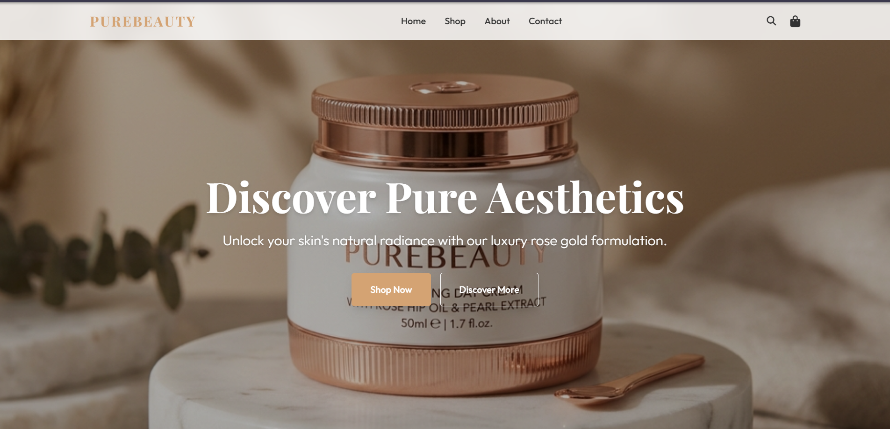
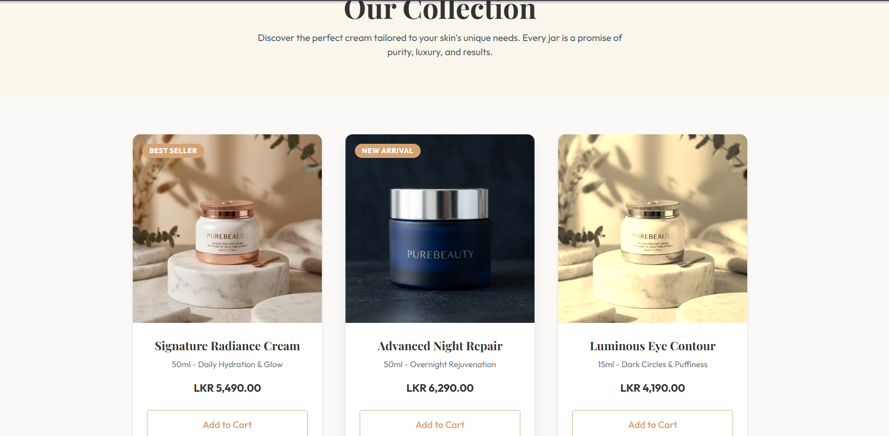
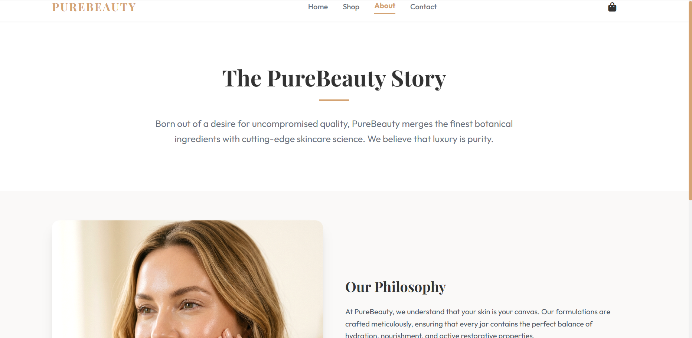
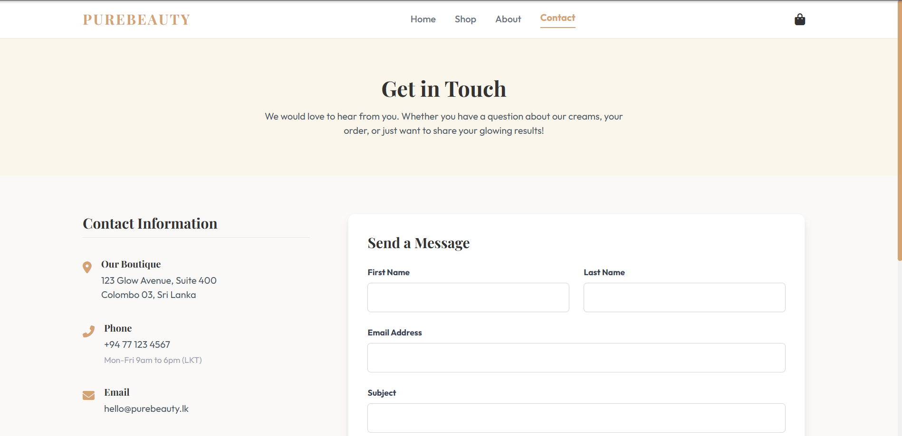
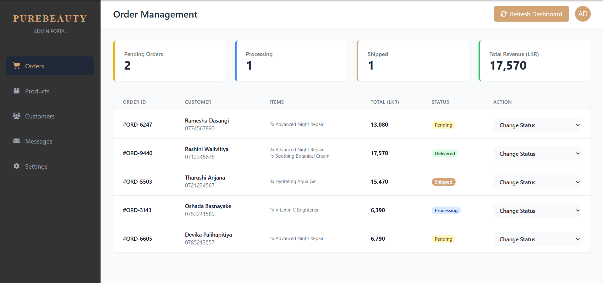

# 🌸 PureBeauty Cream Website

A responsive full-stack e-commerce web application developed for showcasing and managing beauty and skincare products. The project demonstrates responsive web design, shopping cart functionality, backend integration, database management, and an admin dashboard for product management.

---

# 📖 Project Overview

PureBeauty Cream Website was developed to provide customers with a modern and user-friendly online shopping experience for premium beauty and skincare products.

The application allows users to browse products, manage their shopping cart, explore company information, contact customer support, and track their orders. It also includes an administrator dashboard for managing the website.

---

# ✨ Features

- Responsive Website Design
- Product Catalog
- Beauty Product Showcase
- Shopping Cart
- Order Tracking
- Contact Page
- FAQ Page
- Shipping Information
- Privacy Policy
- Admin Dashboard
- Backend Integration
- MySQL Database Connectivity

---

# 🛠 Technologies Used

## Frontend

- HTML5
- CSS3
- JavaScript

## Backend

- PHP

## Database

- MySQL

## Development Tool

- Python *(Used only as a development automation tool to update the shared footer across multiple HTML pages. It is not part of the website backend or runtime.)*

---

# 📂 Project Structure

```text
PureBeauty_Cream-Website
│
├── backend/
├── database/
├── images/
│
├── index.html
├── about.html
├── shop.html
├── cart.html
├── admin.html
├── contact.html
├── faq.html
├── shipping.html
├── privacy.html
├── track.html
│
├── script.js
├── styles.css
├── update_footer.py
├── update_footer.js
├── update_nav.js
│
└── README.md
```

---

# 🌐 Website Pages

- Home
- Shop
- About
- Shopping Cart
- Contact
- FAQ
- Shipping
- Privacy Policy
- Track Order
- Admin Dashboard

---

# 📸 Project Screenshots

## 🏠 Home Page



---

## 🛍 Shop Page



---

## ℹ️ About Page



---

## 📞 Contact Page



---

## 👨‍💼 Admin Dashboard



---

# 💡 Skills Demonstrated

- Responsive Web Design
- Frontend Development
- Backend Development
- Database Integration
- JavaScript Programming
- PHP Development
- MySQL Database Design
- UI/UX Design
- E-commerce Website Development
- Web Application Development

---

# 🚀 Future Improvements

- User Authentication
- Online Payment Gateway
- Product Search & Filtering
- Wishlist
- Customer Reviews & Ratings
- Email Notifications
- Order History
- Inventory Management

---

# 👩‍💻 Author

**Jayani Wijemanna**

---

# 📄 License

This project was developed for educational and portfolio purposes.
